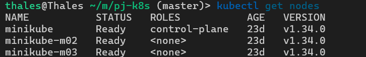
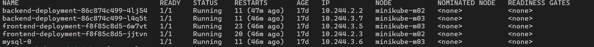
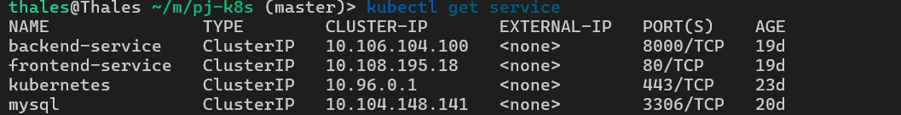
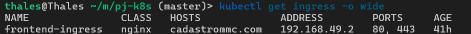
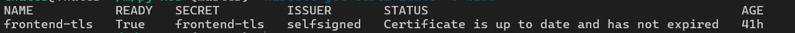
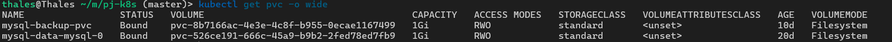
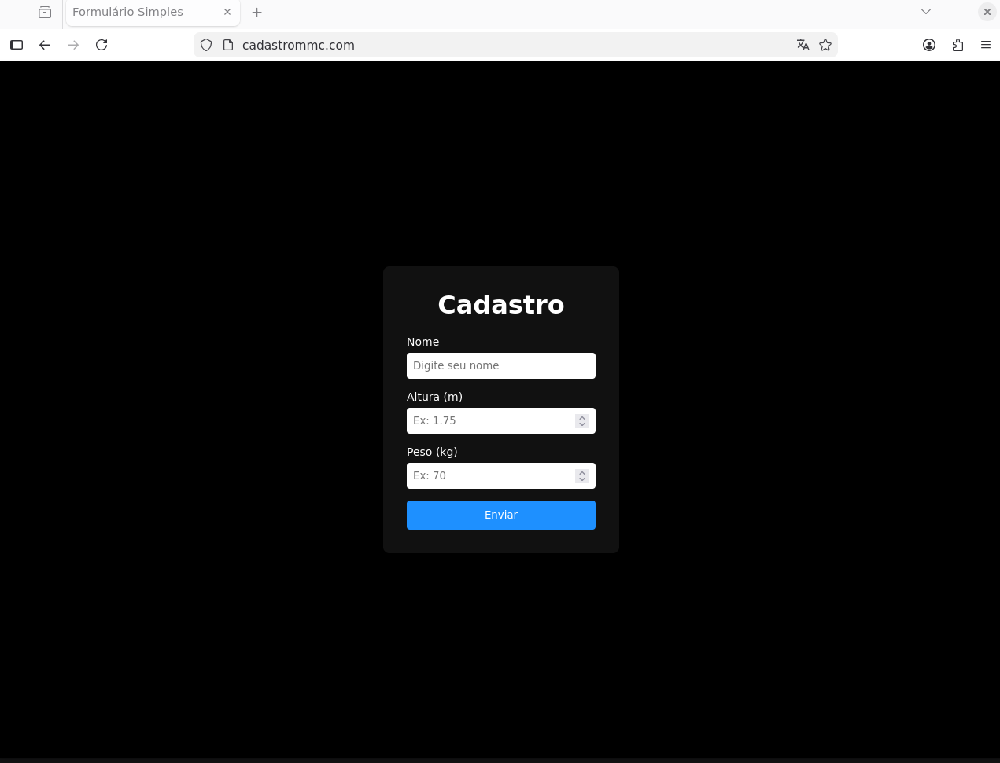
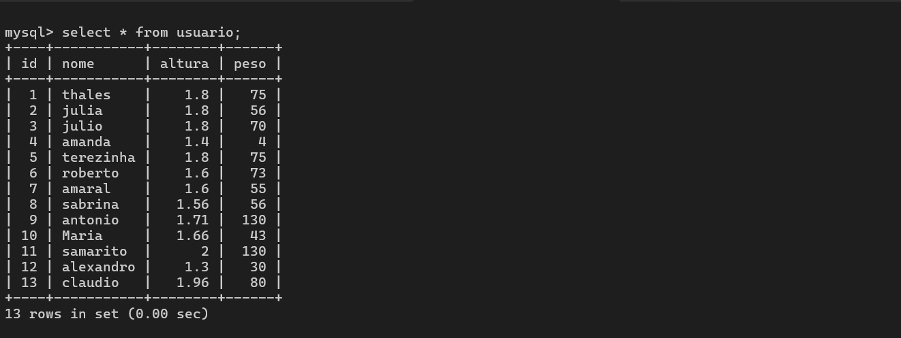
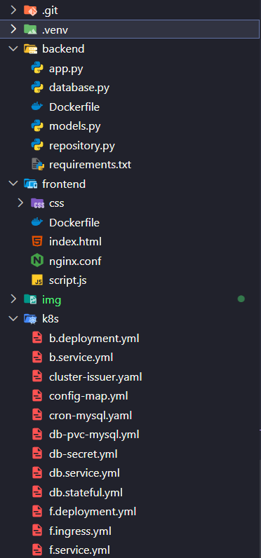

🏗️ Cloud-Ready Infrastructure: Orquestração Full-Stack com Kubernetes
Este repositório apresenta a implementação de uma infraestrutura escalável, resiliente e Cloud-Agnostic para uma aplicação de microserviços. O foco central não é o código da aplicação, mas sim a Engenharia de Plataforma: orquestração de containers, redes lógicas, persistência de dados e automação SRE (Backups).

📐 Arquitetura da Solução
A infraestrutura foi desenhada para separar responsabilidades e garantir que a aplicação seja resiliente a falhas de pods ou nós.

Camadas do Cluster:
Ingress Controller (Nginx): Ponto único de entrada. Gerencia o tráfego externo para o domínio cadastrommc.com com suporte a TLS.

Frontend & Proxy Reverso: O servidor Nginx do frontend serve os arquivos estáticos e atua como API Gateway, roteando chamadas /api/ para o backend, mascarando a infraestrutura interna.

Backend (FastAPI): Camada de lógica stateless, desenhada para escalabilidade horizontal rápida.

Persistence Layer (MySQL): Implementado via StatefulSet, garantindo identidades de rede estáveis (mysql-0) e integridade dos dados através de volumes persistentes.

🗺️ Diagrama da Arquitetura (Data Flow)

graph TD
    User((Usuário)) -->|HTTPS/Port 443| Ingress[Ingress Controller - Nginx]
    Ingress -->|Routing| SvcFront[Service: frontend-service]
    SvcFront -->|Port 80| PodFront[Pod: Frontend + Nginx Proxy]
    
    subgraph "Kubernetes Cluster"
        PodFront -->|Proxy Pass /api/| SvcBack[Service: backend-service]
        SvcBack -->|Port 8000| PodBack[Pod: Backend - FastAPI]
        PodBack -->|SQL Query| SvcDB[Service: mysql]
        SvcDB -->|Port 3306| PodDB[(Pod: MySQL StatefulSet)]
        
        PodDB --- PVC[Persistent Volume Claim]
        Cron[CronJob: Backup] -.->|mysqldump| PodDB
        Cron -.->|Store .sql| BKP_PVC[Backup PVC]
    end

🛠️ Recursos de Infraestrutura & Destaques Técnicos

1. Disponibilidade e Self-Healing
      . ReplicaSets: Configuração de múltiplas réplicas para as camadas de App, garantindo que a aplicação permaneça online mesmo se um pod falhar.
      . Health Checks: Implementação de livenessProbe (verifica se o processo morreu) e readinessProbe (verifica se o app está pronto para receber tráfego), permitindo auto-recuperação imediata.

2. Gestão de Recursos (FinOps Inicial)
      . Resource Limits: Definição rigorosa de limits e requests de CPU e Memória para cada container, evitando o problema de Noisy Neighbors e garantindo estabilidade ao nó.

3. Persistência e Proteção de Dados
      . StatefulSets & PVC: Diferente de Deployments comuns, o banco utiliza volumes que sobrevivem à reinicialização de pods.
      . Backup Automatizado (SRE): Um CronJob realiza dumps diários do banco, salvando-os em um PVC de backup isolado, simulando uma política de Disaster Recovery.

🔐 Segurança e Boas Práticas
      . Segregação de Credenciais: Uso de Kubernetes Secrets para senhas e ConfigMaps para variáveis de ambiente, mantendo o código-fonte limpo.
      . Zero Hardcoded IPs: Toda a comunicação interna é feita via CoreDNS do Kubernetes (Service Names).
      . Segurança de Borda: Ingress configurado para terminar o TLS e proteger o backend de exposição direta à internet.

☸️ Stack Tecnológica
Camada,Tecnologia,Objeto K8s
Frontend,"HTML, CSS, JS, Nginx","Deployment, Service (ClusterIP)"
Backend,"Python, FastAPI","Deployment, Service, HPA (pronto)"
Database,MySQL 8.0,"StatefulSet, Headless Service, PVC"
Infra/Ops,"Docker, K8s, Cert-Manager","Ingress, CronJob, Secret, ConfigMap"

## 🖼️ Evidências de Implementação

### 1. Orquestração e Infraestrutura
Visualização do cluster multi-node e o estado atual de todos os recursos orquestrados.

* **Nós do Cluster (Multi-node):**

* **Pods em Execução (Self-healing & Réplicas):**

* **Serviços Internos (ClusterIP):**

### 2. Rede e Segurança (Ingress & TLS)
Configuração do ponto de entrada único e validação da camada de segurança SSL/TLS.

* **Ingress Controller (Hostname: cadastrommc.com):**

* **Certificado TLS (Self-signed via Cert-manager):**

### 3. Persistência e Aplicação
Prova real da integração entre as camadas e a sobrevivência dos dados no banco.

* **Persistent Volume Claims (Storage):**

* **Interface da Aplicação:**

* **Dados Persistidos no MySQL:**

---

### 📁 Estrutura do Projeto
Visualização da organização de diretórios adotada.

🚀 Como Executar
      1. Pré-requisitos: Cluster Kubernetes (Minikube/Kind) e Ingress Controller habilitado.
      2. Configuração de DNS: Adicione cadastrommc.com ao seu arquivo /etc/hosts apontando para o IP do Ingress.

Deploy:
      kubectl apply -f k8s/

📈 Evoluções Futuras
Implementação de CI/CD via GitHub Actions.

Monitoramento e Observabilidade com Prometheus e Grafana.

Migração para ambiente Cloud Gerenciado (AWS EKS ou Google GKE).

Observação Final: Este projeto demonstra a transição de uma aplicação simples para um ambiente orquestrado profissional, seguindo as melhores práticas da CNCF (Cloud Native Computing Foundation).

